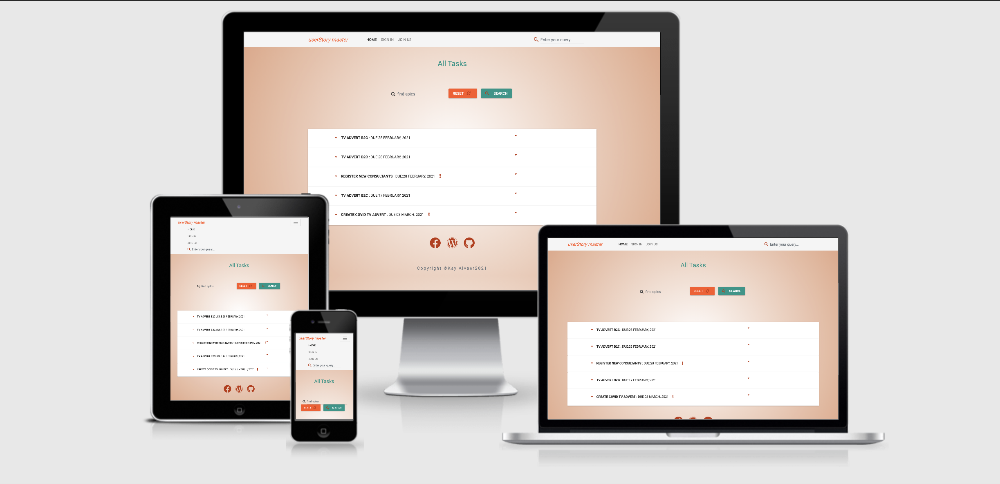
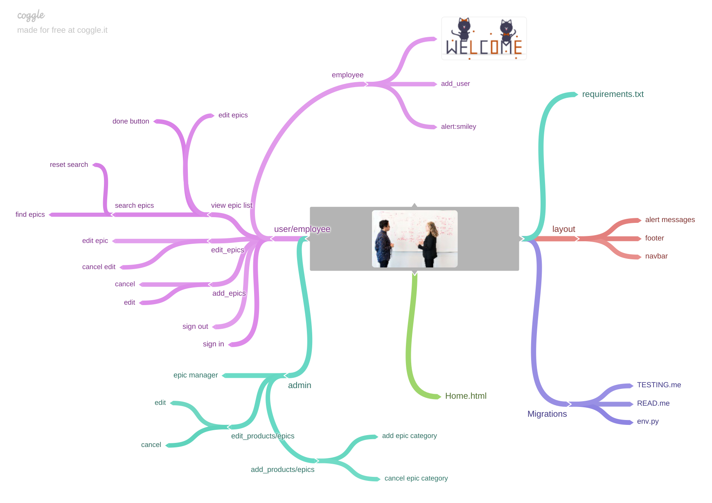
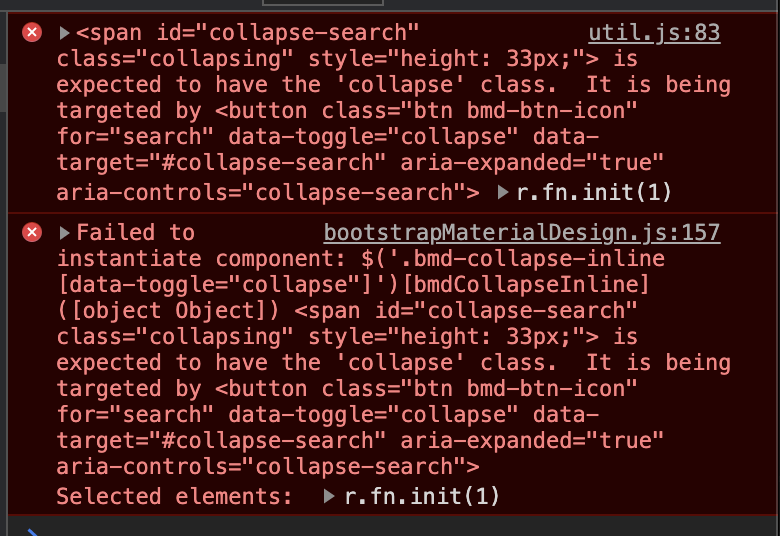

<h1 class="align-center">userStory master epicboard site</h1>

## Code Institute: Milestone Project 3

This project goal is to give employees of any organisation or a department in a company a core working space where they can share write and display their Epics or projects. This aims to allow employees to register themselves and create the project details , following the agile process of creating stories and epics and having a Scrum master and Project owner to manage the overall inputs. The system satisfies the CRUD functionality process. 

For future development i will restrict the kind of information that can be displayed to a non-user. The current information is safe for an inhouse platform, the system makes the other collaborating teams in a common organisation to be aware of the projects a certain department is working on.These helps also for better collaboration and they will know who to contact incase of related queries.

This project is the third one, out of four Milestone Projects in the Full Stack Web Development Program I am attending at The Code Institute. 

**Disclaimer:** The usermanager app is developed for educational purposes only.

**[View project Github repository here.](https://github.com/Kayalvaer/milestone3_kay-alvaer)**
**[Live demo on Heroku pages.](https://kay-user-story-manager.herokuapp.com/home)**

---

## Table of Contents:

- [Design Process](#1.0-UX)
  - [User Stories](#1.1-userstories)
  - [Strategy](#1.2-strategy)
  - [Scope](#1.3-scope)
  - [Structure](#1.4-structure)
  - [UX/UI Design](#1.5-skeleton)
- [Features](#2.0-features)
  - [Existing Features](#2.1-existing-features)
  - [Features to consider implementing in the future](#2.2-features-to-consider-implementing-in-the-future)
- [Technologies Used](#3.0-technologies-used)
  - [Languages](#3.1-languages)
  - [Integrations](#3.2-integrations)
  - [Workspace, Version Control, and Repository Storage](#3.3-workspace-version-control-and-repository-storage)
- [Resources](#4.0-resources)
- [Testing](#5.0-testing)
- [Deployment](#6.0-deployment)
- [Credits](#7.0-credits)
  - [Media](#7.1-media)
  - [Code](#7.2-code)
- [Acknowledgments](#8.0-acknowledgments)

<h1>1. Design Process (UX)</h1>

## 1.1 User stories

_**Site users**_

**As an employee I want:**

- As a user, I want to virtually understand the main purpose of the site and learn more about the organisation.
- As a user, I want to easily sign up to the website.
- As a user, I want to easily Sign in on the site on all pages.
- As a user, I want to be able to and and write epics and user stories after a retrospective, so that if one team member is not available the work can be done.
- As a user, I want to view a list of epics and be able to edit or mark them done as per our team´s agreement of finished projects.
- As a user, I want to see a list of epics and relevant details for epics so that i know what projets are not completed yet.
- As a user, I want to update or delete lists as per the team morals.

_**Developer**_

## 1. Strategy

- Provide a platform where the user can add epics.
- Provide a platform where the CRUD functionality if fulfilled to meet employee expectations.
- Provide a platform where user can see and share new and existing epics.
- Provide a platform which interacts with the users and alerts them, so that their can be aware of their actions.
- Create an enjoyable, and easy to use platform that makes the user enjoy using it frequently.

## 2. Project scope

The idea of this project was inspired of my experience of being an intern in Technical team of an organisation and it was frunstrating, at that time that some of the solutions i knew can easily be solved by technology and my IT skills as a student at that time were limited. I enjoyed it would like to explore other functionalities for expansion. Am thankful to the team and the product manager of the organisation for the inspiration and skills acquired.

- Fits in with my current skill-set of HTML, CSS, JavaScript, Python, Flask and MongoDB and will use my Sass skills for the styling to develop it further.
- Allow the user to sign up into the website with "Register" Button for new users.
- Allow the user to log in into the website.
- Allow the user to create, read, update and delete the epic categories.
- Allow the user to create, read, update, delete and share the epics.

## Structure Plan

Simplicity was the aim here, due to timeline. Four navigation list items were added, which were: "Logo Name" and buttons to redirect the user to othe pages on the site.

- Every page has the same structure to keep consistency and to make the navigation easy to assimilate.
- The Colour themes are consistant as well on all pages.

## 4. UX/UI Choices

### Colors:
- #### Colour scheme
  The colours that are used for the start and game over screen are:
-  #fffff (white)
-  #ffffff (White)
-  #009688 (teal)
-  #ff5722 (orange)
-  #e29584 (light orange)
-  #e29584 (dark orange)

#Color palette designed on [Xd color palette](https://xd.adobe.com/view/2f4f2ab7-d326-408a-a4e4-15ff93b99f26-7a1c/)
[Portfolio website](assets/imgs/figma-color palette.png)

The color choice of this project was putting into consideration the professionalism of the project that can is soft with a blue/greenish and light orange color and vibrant to with the darker version of the bootstrap materialise design orange warning color. The white and dark colors were also added to neutralize the ui tone.

- #### Typography :

"Roboto" font (with fall-back font of Sans-Serif) has been used in the website. It was clear and looked good on the site, with an italic on the logo.

- #### Images:
Some images were used in the website and resized using [tinypng site](https://tinypng.com/) and all of them have a common background gradient of #ffffff and #e29584 colours, as a base colour and gives a different tone to the body.

#### Wireframes:

- Database Diagram to show the interaction anf functionality view of the pages.

- Paper wireframes and Mockup on figma was designed for the project. Most of the work was done on paper because of the strategic placing of the board nodes which were challenging.The mockups were designed with
1. Initial design 
[Wireframes Figma](https://www.figma.com/file/2SsTNHq5U1y25Qgbd8aAnR/The-Systems-Space?node-id=0%3A1) 
2. Changed most of the layout to a new design 
[Wireframes Figma](https://www.figma.com/file/lKQZBpKQDntcB0VcKEZgw2/Untitled?node-id=0%3A3)

- Navigation bar - Menu with links pointing to each page
  - **Home** -  A picture carousel with images that let the user know the collaboration aims of the website and have a visual feel of what it is about.
  - **Sign Up / Sign In** - Which are visible to unregistered users to give them the option to register or for registered ones to sign in. Available on all pages and on the carousel as a button to keep consistency and user friendliness.
  - **Employee Profile** - After users sign up and login, they are redirected to their profile with a flash message welcoming them.
  - **Epics** - A page were the total list of all epics are displayed. here the users can click done button which will delete the epic or edit the epic. The list is open to all employees however managed by admin to trasfer them to other roadmapping matrixes. The epics are open to all employees because the aim is for transparency and core working space. 
  - **Manage Epics** - Only visible to Product owner and Scrum master. This page gives the product owner and scrum master the posibility to see the epics all in a different format for easy transfer into delivery charts and other processes. They can edit and delete the epics as well. 
  and delete it.
 

### 5. Surface
The aim was to achieve an overall clean UX and have it similar in all pages to keep consistency.

## Features

### Existing Features

- Designed with HTML5, CSS3, JavaScript, Python3, Flask, MongoDB and Materalize.
- Responsive navigation bar.
- Button to add new epic.
- Button to edit epics.
- Button to delete epics.
- Button to search epics in the home page however does not allow an unregistered user to edit or do anything to the epic list. But can see what is going on.
- Conditional alerts done by Snackbar popups to alert the user what they did and for the system to be more interactive.
- Footer with social media links.

### Features to consider implementing in the future

- Multifield field for userstories to make the stories writing not boring and easier. wanted to implement it but it didnt work on the site.
- More details for employees will be nice and helpful.
- A display of epic information on chats will be great.
- A common page to display all employees.
- Add lost password functionality.

## Technologies Used

#### 1. Languages

- [HTML5](https://en.wikipedia.org/wiki/HTML5)
- [CSS](https://en.wikipedia.org/wiki/CSS)
- [JavaScript](https://en.wikipedia.org/wiki/JavaScript)
- [Python](<https://en.wikipedia.org/wiki/Python_(programming_language)>)

#### 2. Integrations

- [Google Fonts](https://fonts.google.com/) - Typography.
- [FontAwesome](https://fontawesome.com/) - Used for icons.
- [Bootstrap Material design](https://mdbootstrap.github.io/bootstrap-material-design/docs/4.0/bootstrap-components/buttons/) - CSS framework.
- [jQuery](https://jquery.com/) - JavaScript library.
- [Flask](https://flask.palletsprojects.com/en/1.1.x/) - Micro web framework written in Python.
- [MongoDB](https://www.mongodb.com/) - NoSQL database program, using JSON-like documents.

#### 3. Workspace, version control, and repository storage

- [vscode](https://code.visualstudio.com/) - IDE (Integrated Development Environment) used to write the code.
- [GitHub](https://github.com/) - Repository hosting service to host the deployed website and track previous versions of code.
- [Git](https://git-scm.com/) - Version control tool to record changes and updates to my files.
- [Heroku](https://www.heroku.com/) - Container-based cloud platform for deployment and running of apps.

## Resources

- [W3.CSS](https://www.w3schools.com/w3css/defaulT.asp) - General resource.
- [Stack Overflow](https://pt.stackoverflow.com/) - General search resource.
- [Medium Blog site](https://medium.com/codex/simple-registration-login-system-with-flask-mongodb-and-bootstrap-8872b16ef915) - my favourite resource for ideas and when am stuck.
- [CSS Matic](https://www.cssmatic.com) - Box Shadow Genetator.
- [CommonMark](https://commonmark.org/) - For Markdown language reference.
- [Coolors](https://coolors.co/) - Find matching color palette for site.
- [TinyPNG](https://tinypng.com/) - Efficient compression of images for site.
- [Figma](https://www.figma.com/) - Wireframing and prototyping design tool.
- [Autoprefixer](https://autoprefixer.github.io/) - Parses CSS and adds vendor prefixes.
- [Figma](https://www.figma.com/) - Web-based UI and UX design application.
- [Quick DBD](https://www.quickdatabasediagrams.com/) - Draw your database relationship diagrams and flow quickly using simple DSL language.
- [Google Mobile-Friendly](https://search.google.com/test/mobile-friendly) -  Mobile-friendly test on site.
- Code Institute SLACK Community - General Resource

## Code Validation

- [W3C](https://validator.w3.org/) - HTML Markup Validation.
- [Closing Tag Checker for HTML5](https://www.aliciaramirez.com/closing-tags-checker/) - Validates that all tags are opening and closing correctly.
- [W3C](https://jigsaw.w3.org/css-validator/) - CSS Validation.
- [JSHINT](https://jshint.com/) - JavaScript code warning & error check.
- [PEP8 online](http://pep8online.com/) - PEP8 validator.

## Testing

Most of the testing was done throughout the development and errors fixed as I coded normal errors that cannot be resolved because of jinja were there but my mentor said it is normal. some of them included in the stackflow fields mentined below. the heroku URL was then tested on:
 - [W3C](https://validator.w3.org/)  and the results were as follows:

- [Closing Tag Checker for HTML5](https://www.aliciaramirez.com/closing-tags-checker/) - Validates that all tags are opening and closing correctly.
- [W3C](https://jigsaw.w3.org/css-validator/) - CSS Validation.
- [JSHINT](https://jshint.com/) - JavaScript code warning & error check.

- [PEP8 online](http://pep8online.com/) - PEP8 validator. No errors were displayed during deployment and submission.

[HERE](static/testing/TESTING.md)

Testing documentation can be found [HERE](static/testing/TESTING.md)

## Project barriers and solutions
- In the employee page I had added a form in the edit modal to allow employees or users to add more details about themselves like
images, birthdate to achieve a more personalised introduction of employees to others. 
The modal failed to load and post data to heroku. The basic user registration field was left as basic as possible
and there expansion of the input fields in the sign-in can be a future expansion projects with more time needed.
- The epic lists gaveme issues to open because of the naming of the targeted data, and i contacted tutor support
for assistance which actually required me to use both the function and the id name and data-targets when calling the function (From line 60 on epic.html page)

## Deployment

### Project Creation
- To create this project the [visualstudiocode](https://code.visualstudio.com/).
- Repo was created in Github and connected to vscode and my code pushed through the command line.
- The Github was also linked to heroku and deployed.

### Deployment to Heroku
This project is deployed and hosted on [Heroku](https://www.heroku.com/).
- Navigate to [Heroku](https://www.heroku.com/) and login.
- On the dashboard, click on the 'New' button and select 'Create new app'.
- Enter the app name and select a region.
- Under the 'Settings' tab, click on 'Config Vars' to add Configuration Variables from the env.py file. This includes the IP, Port, 
Secret key, MongoDB name and URI, as well as mail settings for Flask Mail.
- In the menu select the 'Deploy' option.
- Under 'Deployment method' select the GitHub option to connect to your GitHub repository. Ensure GitHub username is selected and 
use the search function to find the relevant repository.
- Select Automatic deploys from the main branch and click 'Deploy Branch'.

### Cloning
- The code can be run locally through clone or download from the repository on GitHub.
- You can do this by opening the repository, clicking on the green 'Code' button and selecting either 'clone or download'.
- The Clone option provides a URL, which you can use on your CLI with **git clone <url>**.
- The Download ZIP option provides a link to download a ZIP file which can be unzipped on your local machine. The files can then 
be uploaded to your IDE

## Credits

- #### Media
**Illustrations and Icons**:
- [Undraw](https://undraw.co/)
- [Unsplash](https://unsplash.com/)
- [ManyPixels](https://www.manypixels.co/)
- [FontAwesome](https://fontawesome.com/)

- #### Code
- AttributeError: 'module' object has no attribute 'exist' assisted by input fields from Stack Overflow [here](https://stackoverflow.com/questions/52457552/attributeerror-module-object-has-no-attribute-exist).
- Error discovered when connecting app to Heroki included “ERROR: No matching distribution found for numpy” when deploying app to Heroku and this link was helpful [here](https://stackoverflow.com/questions/66182906/error-no-matching-distribution-found-for-numpy-when-deploying-app-to-heroku).
- Error in connection mongodb atlas to shell sorted with input from [here](https://stackoverflow.com/questions/62466849/error-in-connection-mongodb-atlas-to-shell).
- To overcome the understanding of the crud functionality i found this article helpful in addition to code institute tutorials [here](https://medium.com/@gokulprakash22/getting-started-with-flask-pymongo-d6326db2a9a7).
- I did not use Materialize but bootrap materialize and this helped me to adjust my button layout and make them responsive together with my bootstrap knowledge [here](https://stackoverflow.com/questions/45822665/how-to-make-materializecss-buttons-stack-nicely-on-small-screens).
- Error handling code I refered to the net link [here](https://flask.palletsprojects.com/en/1.1.x/patterns/errorpages/).

- A bmd error which I have no control over have created two errors on the console. this is comming from bootstrap material design css framework. 

## Acknowledgments
- Thanks for my mentor, Aaron Sinnott for guidence and excellent advices.
- Thanks to all Code student support and tutor team Tim for the tutorials and his github projects which were helpful for my project.
- Thanks to CI Slack Community for all the assistance and support.
- Thanks for all the web development community on Internet especially stackflow.